# udSDK- Unity Plugin

This project demonstrates the use of Euclideon udSDK developer Kit (udSDK SDK) with the Unity Real Time Development Platform. 

```
Language:              C#
Type:                  Integration
Contributor:           Euclideon udSDK Development Team <support@euclideon.com>
Organization:          Euclideon, https://www.euclideon.com/
Date:                  2020-08-10
Last Updated:          2021-09-24
udSDK Version:         2.1.0
Toolsets:              Requires Unity >= 2019.3.4f1
```

## Quickstart guide 

**The Unity-udSDK sample requires a free Euclideon Account to use, licenses can be obtained [here](https://www.euclideon.com/udsdk/)** 
The udSDK is tested with Unity on following versions:
```
- 2021.1.22f1
- 2020.3.18f1
- 2020.1.9f1
- 2019.3.4f1
```
It may work in other versions of Unity, but no guarantee is provided for this. Please ensure you have one of the tested versions installed.

### Installation - Github Samples
1. Download and extract the latest udSDK package from [here](https://udstream.euclideon.com) using your license credentials. You can obtain a free account [from our website](https://www.euclideon.com/free-development-resources/) 

2. Clone the Unity udSDK examples source code from [here](https://github.com/Euclideon/udSDKUnity) or Download as a zip.

   

3. Copy **all** files from the SDK that correspond to your operating system to your Unity project root. These can be found at the path: `udSDK/lib/{Your_operating_environment}/`
   
   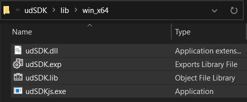
   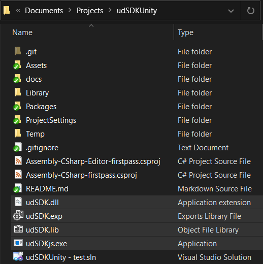


4. Open the udSDK Unity example scenes by navigating to the 'udSDKUnity' directory and opening Basic Render from **./Assets/Plugins/EuclideonUdSDK/Sample Scenes/**, either on file explorer or Unity Project Explorer


5. Open Unity Hub, select add and then browse the cloned or downloaded project folder


6. From the toolbar on top of the Unity Editor, Navigate to Euclideon > udSDK Login - enter your Euclideon username and password, then press Confirm to save your credentials


7. udSDK with Unity is now ready to go, click 'play'!

### Changing UDS model url

The UDS model can be changed by modifying the path attribute of the 'UDS Model' object in the project hierarchy (by default on the *left* of the screen) using the inspector (by default on the *right*)

There is a UDS model included with this example for demonstration purposes, paths to your own model can be pasted into the _path_ field of the US model object
UDS file format developed by Euclideon allowing streamable, unlimited sized 3D datasets requiring only low spec hardware. 

Models can be created from most common photogrammetry and LiDAR point clouds file formats using Euclideon [udStream](https://www.euclideon.com/vault/) available [Here](https://www.euclideon.com/udstream-free/) your vault SDK trial license also gives you access to vault client during your trial period.
You can read about the conversion process [here](https://www.euclideon.com/wp-content/uploads/2019/10/2019_10_31-udSDK-Conversion-Guide-v1.2.pdf) if you have any questions check the [support knowledge base](https://desk.euclideon.com) or on the 

Photogrammetry model of the Gold Coast courtesy of [Aerometrex](https://aerometrex.com.au/)

# Sample Scenes
Each included example is accompanied by a scene demonstrating the use of the objects. The best way to become farmiliar with these unity objects is to explore their usage in those scenes.
Currently there are 6 sample demo scenes
- Basic Render - Import a UDS and use the picking system to extract voxel data.

- Driving demo - Use the udSDK collider object to make localized mesh colliders for physics simulation.

- Filter Demo - Use of a query filter to selectively render volumes of the point cloud.

- Raycasting Example - Use the udSDK Collider to estimate surface distance using raycasting.

- Projects demo - Import a udStream Project including models, media and POIs into your Unity scene.

- DepthOfField - Explore visual effects using the depth buffer to simulate a camera lens effect.


Examples of use of the API features are located under Assets/Plugins/EuclideonUdSDK/Scenes 
## Basic Example

This is an example demonstrating how to use udSDK with Unity, it includes a minimalist example of a flight camera and an attached collider.
Unlimited Detail rendering is implemented as a postprocessing effect that can be applied to cameras to display UDS objects.


### Sample Scene Structure
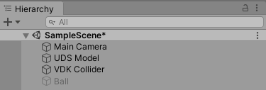

#### Main Camera

The main view used in the example. It has a flight camera script attached to it to enable user interation. Of importance to this object is 
the implemented post process layer and volume properties which must be included for the camera to view UDS files. 

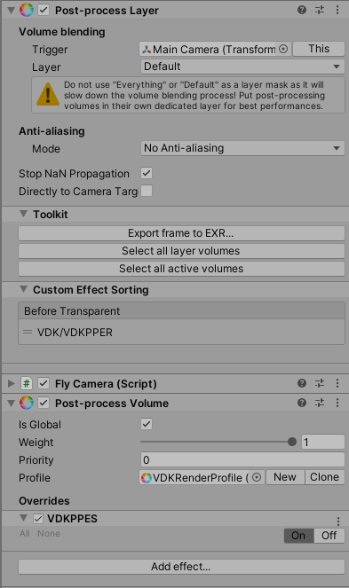

Various settings can be passed to the renderer including the point rendering mode (rectangle, cube or point), the desired resolution scaling and example interfaces for picking of voxels

### UDS Model

Each of UDS to be loaded in unity is represented as a one of these models.

### udLogin

This file contains the login logic for the unity example, including login credentials. GlobaludSDKContext contains a ``` udContext``` for managing licensing 
and login information between objects, and a ```udRenderContext```, enabling the rendering of and caching the UDS model information

### UDPPER 

_UDPPES.cs_ contains the implemention of udSDK in Unity as a post processing effect. The associated shader is ```udShader.shader```

### UD Collider

This object demonstrates how to achieve physical collisions between Euclideon UDS models and native Unity colliders. Because of the potential scale of UDS objects it is not practical to construct mesh colliders of UDS objects (espeially if these objects are being streamed externally)
The approach taken is to construct a mesh of the UDS object local to a point of interest (for example a player or the potential colliding object using information available from an instance of ```udRenderView```. 

Because the information contained in UDS files (especially unfiltered point clouds) can be noisy, we have included functionality to smooth the generated surfaces.

_UDCollider.cs_ contains the majority of the logic associated with the example collider system.
 
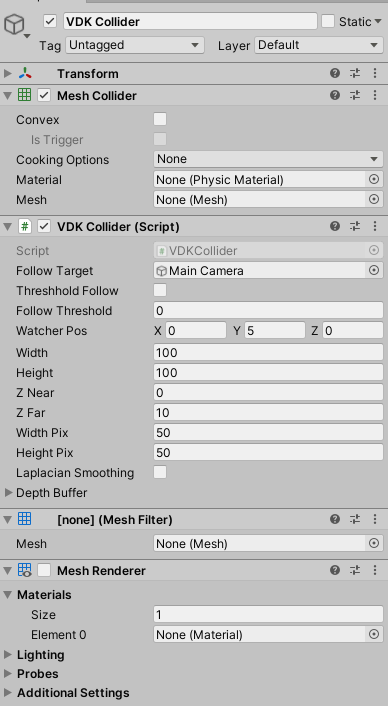

_Because Unity does not allow collisions between a parent and child object, the collider cannot be a direct decendent of an object it is intended to collide with. 
Instead use the follow target parameter to keep the collider within an objects reference frame_

The UD Colider Script takes the following parameters:

_Follow Target:_ If not none will set the transformation of the collider to match that of the target, useful for meshing locally around 
particular objects. 

_Threshold Follow:_ Determines the rate at which the location of the collider is updated, if true the location of the collider is updated only when the object is _Follow Threshold_ distance from the watcher position

_Watcher Pos:_ The location of the virtual camera in the local frame used to generate the collision mesh. Currently this should be set to 0.5*(ZNear-Zfar) in the direction the cameara is intended to look, this is to prevent unwanted clipping

_width, height:_ the dimensions of the polygon 'sheet' draped over the UDS model in metres, smaller colliders will have a higher polygon density and therefore better collision accuracy at lower computational cost

_Z Near, Z far:_ the locations of the near and far plane along the local z axis for the 'watcher' camera used to generate the collision polygon. 

_Width Pix, Height Pix:_ The number of pixels used to find the position of the vertices in the sheet. Currently this is equal to the number of vertices in the collision mesh. Smoother results may be obtained in future versions by oversampling around the vertex locations and averaging to eliminate noise.
These values have a large impact on frame rate and should be kept as low as possible. Increasing these improves the accuracy of the produced collision mesh.

_Laplacian Smoothing:_ This determines if smoothing should be applied to the collider, this has the effect of removing noise from laser scans at the cost of potentially removing 'sharp' features from the collision mesh.

Smoothing off (note the rougher ground surface due to sensor noise):
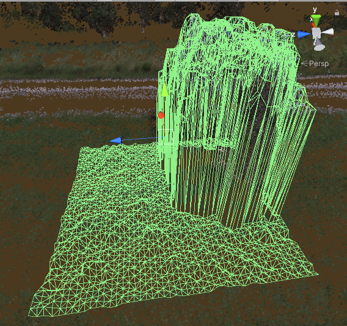 

Smoothing on (note that tree branches are no longer captured by the collision model):
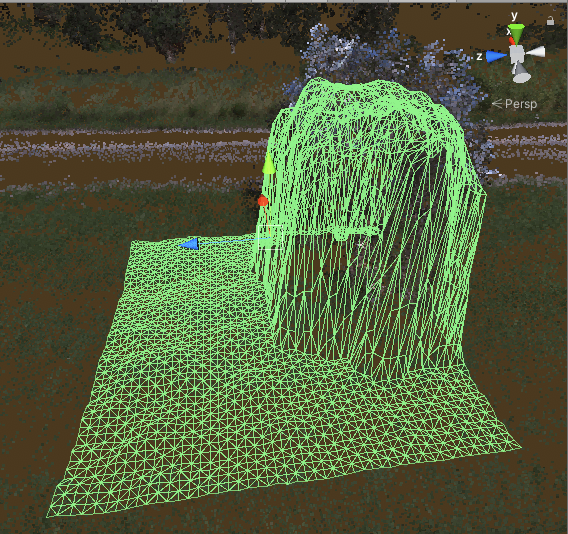

As the attached mesh is modified often by this script, baking options for the mesh collider should be turned off for performance reasons

## Creating a Build

When you create a build, please do the following : 
1. In File -> Build Settings ensure that the "Menu 3d" Scene is loaded first, then the first scene in your application
2. Once built, ensure that the appropriate udSDK contents are copied into the build folder.

If you would like to include your uds models with the build, rather than served over a network, then please consider the following workflow.

#### Streaming Assets
The streaming assets workflow is required to support filetypes such as uds, that are not recognized by Unity. It is a simple way to ensure that files are included in the build package as is; beware, anything you put in this folder will be 

1. In your root assets directory, create a "StreamingAssets" folder.
   
   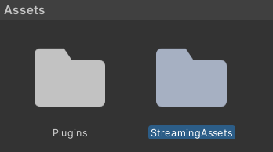
   
2. Put any models you would like exported in your build into that folder.
   
   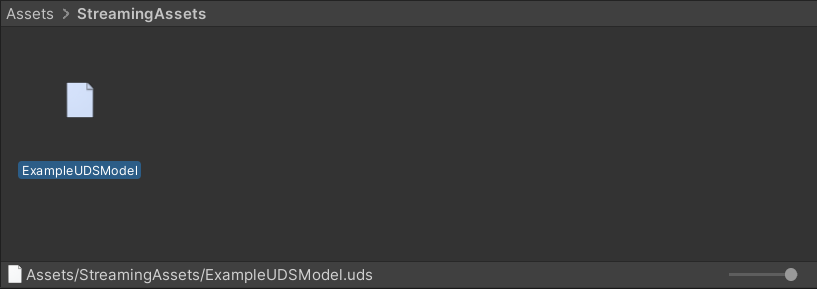
   
3. Enter a relative filepath as the URI for your uds model, like so:
   - Right click and copy path
   
   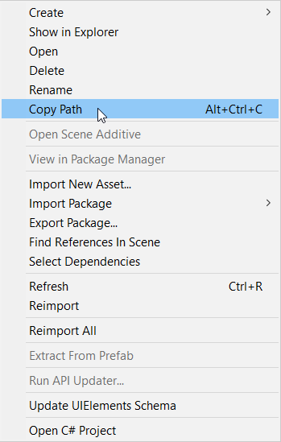
     
   - Enter path in UDSModel component
   
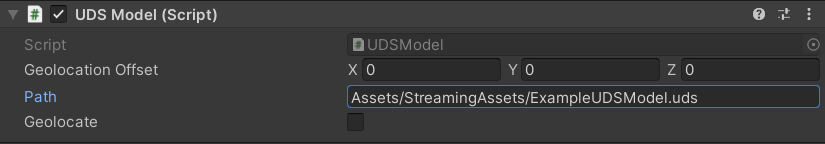

## Android Support

The provided scenes have been tested on Android:
Compiling to Android involves the following:
1. Copy udSDK.so from `[udSDK Location]\lib\android_arm64\libudSDK.so` (or android X64 depending on your target platform) to `Assets/Plugins/EuclideonUdSDK`
2. Select the newly added file from the Unity project pane and in the inspector under platform settings select your target platform and check the box "Load on startup"
3. In File -> Build Settings ensure that the "Menu 3d" Scene is loaded first, then the first scene in your application
4. In the bottom left of this window click player settings -> Android settings, set the scripting backend to IL2CPP and the target architecture to ARM64 (or X64 if you are using that platform)


