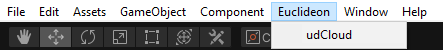
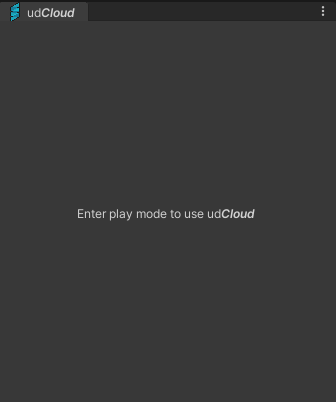
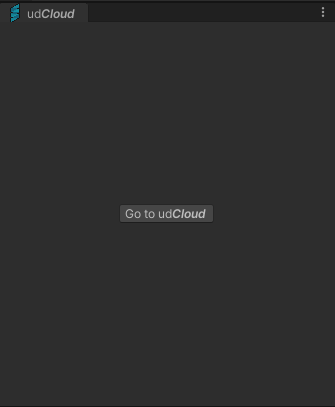
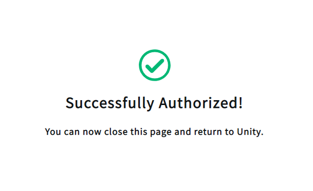
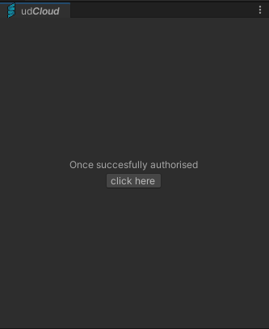
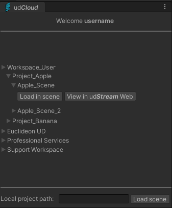
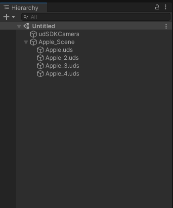
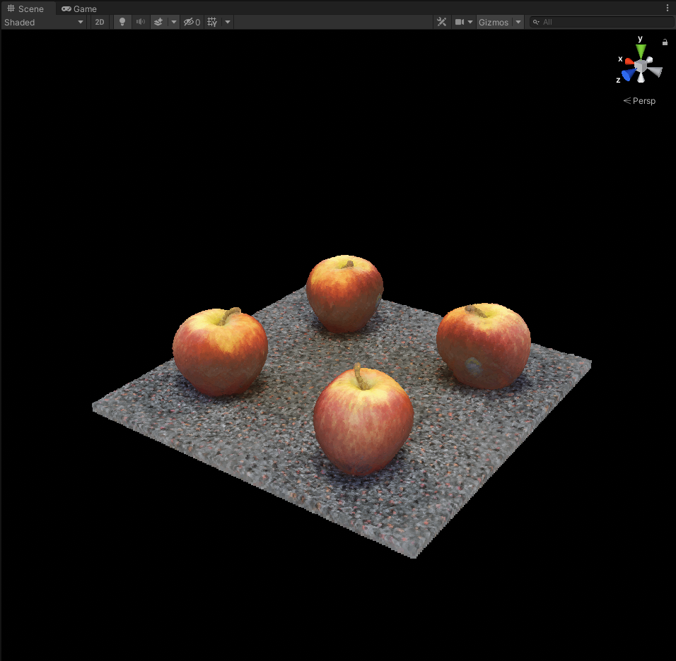

# ud***Cloud*** Integration - **Unity**


This **Unity** integration utilises the ud***SDK*** (v2.2) to create an interface for ud***Cloud*** directly within **Unity**. Scenes from ud***Cloud*** may be viewed in the **Unity** Editor, and become fully interactable GameObjects to use within a **Unity** scene. 

---

```
Language:              C#
Type:                  Integration
Contributor:           Euclideon udSDK Development Team <support@euclideon.com>
Organization:          Euclideon, https://www.euclideon.com/
Date:                  2022-01-18
Last Updated:          2022-01-18
udSDK Version:         2.2.0
Toolsets:              Requires Unity >= 2019.3.4f1
```

## **Quickstart Guide**

**This Unity-ud*SDK* sample requires a free Euclideon Account to use, licenses can be obtained [here](https://www.euclideon.com/udsdk/). To utilise the benefits of this sample, one must also have a ud*Cloud* account, and have a workspace already embedded with a ud*Cloud* scene containing UDS models. Follow this [link](https://www.euclideon.com/udCloud/) to get started.**

The ud***SDK*** is tested with **Unity** on the following versions:
```
- 2021.1.22f1
- 2020.3.18f1
- 2020.1.9f1
- 2019.3.4f1
```
It may work in other versions of **Unity**, but no guarantee is provided for this. Please ensure you have one of the tested versions installed.

## **Installation**
1. Download and extract the latest ud***SDK*** package from [here](https://udstream.euclideon.com) using your license credentials. You can obtain a free account [from our website](https://www.euclideon.com/free-development-resources/) 

2. Clone the Unity ud***SDK*** examples source code or download as a zip.

3. Copy **all** files from the SDK that correspond to your operating system to your **Unity** project root. These can be found at the path: `udSDK/lib/{Your_operating_environment}/`

4. Open **Unity Hub**, select add and then browse the cloned or downloaded project folder

5. Open the example **Unity** scene (an empty scene) by navigating to the 'udSDKUnity' directory and opening *Sample Scene* from **./Assets/Plugins/EuclideonUdSDK/**, either in file explorer or the **Unity** project explorer

## **Usage**

1. From the toolbar on top of the Unity Editor, Navigate to Euclideon > udCloud. This will open the ud***Cloud*** tab in the editor.

<p align="center">


<p align="center">


2. Click *Play* and follow the button prompt that appears in the window.

<p align="center">


3. This will open a ud***Cloud*** portal in a browser window, where you may enter your ud***Cloud*** credentials. Wait for the *Successfully Authorized!* tick to appear, then return to **Unity**.

<p align="center">


4. Now click the button prompt after successful authorisation.

<p align="center">


5. Your username will appear at the top of the window, and you now have access to all workspaces associated with your account, displayed in a heirarchy tree. To view a particular scene in Unity, navigate the tree to your scene, and select *Load in scene*.

<p align="center">


6. This will instantiate an interactable GameObject of your ud***Cloud*** scene, with all it's UDS models as child GameObjects, positiined as they would be in the project file, along with visualisation support for some POI annotations that are included in your ud***Cloud*** scene.

<p align="center">


<p align="center">


## **Features**
---
### ud***Cloud*** Scene

A ud***Cloud*** scene (a udStream project file) is a collection of UDS models and annotations, gathered into a single file. This ud***Cloud*** integration loads that scene directly, loading the UDS models relative to eachother, just as they would be positioned in the ud***Cloud*** scene.

---
### udProjectNodes

Each GameObject that this integration introduces to the **Unity** scene has a udProjectNode attached to it, which reflects it's heriarchical position in the ud***Stream*** project file.

---

### UDS model

A UDS model is a Euclideon Unlimited Detail Point Cloud file.

---

### udCloudNode

The data retrieved from udCloud is packaged in a heirarchy of udCloudNodes. Stemming from the User, to their workspaces, to projects, then to the scenes themselves.

---